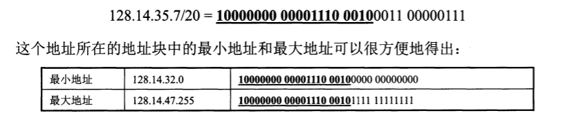

- [网络层](#网络层)
  - [网络层提供的两种服务](#网络层提供的两种服务)
  - [网际协议IP](#网际协议ip)
    - [虚拟互连网络](#虚拟互连网络)
    - [分类的IP地址](#分类的ip地址)
    - [IP地址与硬件地址](#ip地址与硬件地址)
    - [地址解析协议ARP](#地址解析协议arp)
    - [IP数据报的格式](#ip数据报的格式)
    - [IP层转发分组流程](#ip层转发分组流程)
  - [划分子网和构成超网](#划分子网和构成超网)
    - [划分子网](#划分子网)
      - [从两级IP地址到三级IP地址](#从两级ip地址到三级ip地址)
      - [子网掩码](#子网掩码)
    - [使用子网时分组的转发](#使用子网时分组的转发)
    - [无分类编址CIDR（构成超网）](#无分类编址cidr构成超网)
      - [网络前缀](#网络前缀)
      - [最长前缀匹配](#最长前缀匹配)
  - [网际控制报文协议ICMP](#网际控制报文协议icmp)
    - [ICMP报文的种类](#icmp报文的种类)
    - [ICMP的应用举例](#icmp的应用举例)
  - [互联网的路由选择协议](#互联网的路由选择协议)
    - [有关路由选择协议的几个基本概念](#有关路由选择协议的几个基本概念)
      - [理想的路由算法](#理想的路由算法)
      - [分层次的路由选择协议](#分层次的路由选择协议)
    - [内部网关协议RIP](#内部网关协议rip)
      - [工作原理](#工作原理)
      - [距离向量算法](#距离向量算法)
      - [RIP协议的报文格式](#rip协议的报文格式)
    - [内部网关协议OSPF](#内部网关协议ospf)
      - [OSPF协议的基本特点](#ospf协议的基本特点)
      - [OSPF的五种分组类型](#ospf的五种分组类型)
    - [外部网关协议BGP](#外部网关协议bgp)
    - [路由器的构成](#路由器的构成)
      - [路由器的结构](#路由器的结构)
  - [IPv6](#ipv6)
    - [IPv6的基本首部](#ipv6的基本首部)
    - [IPv6的地址](#ipv6的地址)
    - [从IPv4向IPv6过渡](#从ipv4向ipv6过渡)
      - [双协议栈](#双协议栈)
      - [隧道技术](#隧道技术)
    - [ICMPv6](#icmpv6)
  - [多播](#多播)
    - [多播的基本概念](#多播的基本概念)
    - [在局域网上进行硬件多播](#在局域网上进行硬件多播)
    - [网际组管理协议IGMP和多播路由选择协议](#网际组管理协议igmp和多播路由选择协议)
      - [IP多播需要两种协议](#ip多播需要两种协议)
      - [网际组管理协议IGMP](#网际组管理协议igmp)
      - [多播路由选择协议](#多播路由选择协议)
  - [虚拟专用网VPN和网络地址转换NAT](#虚拟专用网vpn和网络地址转换nat)
    - [虚拟专用网VPN](#虚拟专用网vpn)
    - [网络地址转换NAT](#网络地址转换nat)

## 网络层

### 网络层提供的两种服务

- 面向连接的虚电路服务

- 面向无连接的数据报服务

  

### 网际协议IP

- 网际协议IP是TCP/IP体系中两个最主要的协议之一。

- **RARP**：地址解析协议

- **ICMP**：网际控制报文协议

- **IGMP**：网际组管理协议

  

#### 虚拟互连网络

- 图4-3(a)表示由许多计算机网络通过一些路由器互连。

- 由于参加互连的计算机网络都使用相同的网际协议IP，因此可以把互连以后的计算机网络看成如图4-3(b)所示的一个虚拟互连网络。

- 所谓虚拟互联网络也就是逻辑互连网络，他的意思就是互连起来的各种物理网络的异构性本来是客观存在的，但是我们利用IP协议就可以使这些各异的网络在网络层上看起来好像是一个统一的网络。

  

#### 分类的IP地址

- IP地址就是给互联网上的每一台主机(或路由器)的每一个接口分配一个全世界范围内是唯一的32位的标识符。

- IP地址的编址方法经过了三个历史阶段

  1. **分类的IP地址**
  2. **子网的划分**
  3. **构成超网**

- 分类的IP地址

  - 将IP地址划分为若干个固定类，这里的A、B、C类地址都由两个固定长度的字段组成，第一个是网络号，表示主机（或路由器）所连接到的网络，第二个是主机号，它标志该主机（或路由器）

    

  - A类
    - 可指派的网络号为$$2^7 - 2$$，全0是保留地址，表示“本网络”，全1保留作为本地软件环回测试，第一个可指派的网络号是`1`，最后一个可指派的网络号是`126`
    - 最大主机数是$$2^{24} - 2$$，全0表示主机所连接到的网络地址，全1表示该网络上的所有主机
  - B类
    - 可指派网络数为$$2^{14} - 1$$，`128.0.0.0`不指派，第一个可指派的网络号是`128.1`，最后一个可指派的网络号是`191.255`
    - 最大主机数是$$2^{16} - 2$$，扣除全0全1
  - C类
    - 可指派网络数为$$2^{21} - 1$$，`192.0.0.0`不指派，第一个可指派的网络号是`192.0.1`，最后一个可指派的网络号是`223.255.255`
    - 最大主机数是$$2^{8} - 2$$，扣除全0全1

#### IP地址与硬件地址

- 物理地址（MAC地址/硬件地址）是数据链路层与物理层使用的地址；IP地址是网络层和以上各层使用的地址，是一种逻辑地址（称为逻辑地址是因为其用软件实现的）

#### 地址解析协议ARP

- 解决同一个局域网上的主机或者路由器的IP地址和硬件地址的映射问题，如果是不同网络之间，就需要靠路由器来转发
- 为什么要用ARP来转换IP地址和硬件地址？直接用硬件地址通信不可以吗
  - 全世界存在着各式各样的网络，它们使用不同的硬件地址，如果要使这些异构网络能互相通信，就需要非常复杂的硬件地址转换工作，IP编址解决了这个问题

#### IP数据报的格式

- IP数据报 = 20字节固定部分 + 可变部分 + 数据部分

  
  - 版本：即IP协议的版本，占4位，通信双方的IP协议版本必须一致
  - 首部长度：表示首部的数据量，占4位，单位是32位字(即4字节)。因首部固定部分是20字节，所以最小值是5，最大值是15，即60字节。当首部长度不是4字节的整数倍时，必须利用最后的填充字段加以填充
  - 区分服务：占8位，一般情况下不使用
  - 总长度：首部+数据之和的长度，单位为字节，占16位
  - 标识：占16位，是IP软件在存储器里维持一个计数器，每产生一个数据报就+1，并赋值给此标识字段，这个“标识”并不是序号，因为IP是无连接服务，不存在按序接收的问题。当数据报由于长度超过网络的MTU（IP层下面的每一种数据链路层协议都规定的数据帧中的数据字段的最大长度，即IP数据报的总长度一定不能超过MTU）而必须分片时，此标识字段就会被复制到所有的数据分片的标识字段中，相同的标识字段使得分片后的各数据报最后能正确的重装称为原来的数据报
  - 标志：占3位，目前只有前两位有意义
    - 最低位记为MF，MF=1标识后面“还有分片”的数据报，MF=0表明这是若干数据报分片中的最后一个
    - 中间一位记为DF，意思是不能分片，只有当DF=0才允许分片
  - 片偏移：占13位，片偏移表示较长的分组在分片后，某片在原分组中的相对位置，单位为8字节，即分片的长度一定是8字节整数倍
  - 生存时间：占8位，表示数据报在网络中的寿命，单位为跳数，即能经过多少个路由器（最大为255）
  - 协议：占8位，表示所携带的数据是使用何种协议，以便目的主机IP层知道上交给哪个协议进行处理
  - 首部检验和：占16位，只检验数据报的首部，不包括数据部分，
  - 源地址：占32位
  - 目的地址：占32位
  - 可变部分：从1-40个字节不等，实际上很少被使用

#### IP层转发分组流程

- IP数据报最终一定可以找到目的主机所在的目的网络上的路由器（可能经过多次间接交付）
- 只有到达最后一个路由器时，才试图向目的主机进行交付
- 分组转发算法如下
  1. 从数据报的首部提取目的主机的IP地址D，得出目的网络地址为N
  2. 若N就是与此路由器直接相连的某个网络地址，则进行直接交付，不需要再经过其他的路由器，直接把数据报交付目的主机（这里包括把目的主机地址D转换为具体的硬件地址，把数据报封装为帧，再发送此帧）；否则就是间接交付，执行3
  3. 若路由表中有目的地址为D的特定主机路由，则把数据报传送给路由表中所指明的下一跳路由器；否则执行4
  4. 若路由表中有到达网络N的路由，则把数据报传送给路由表中所指明的下一跳路由器，否执行5
  5. 若路由表中有一个默认路由，则把数据报传送给路由表中所指明的默认路由，否则执行6
  6. 报告转发分组出错。
- 当路由器收到一个待转发的数据报，在从路由表得出下一跳路由器的IP地址后，不是把这个IP地址填入数据报，而是送交数据链路层的网络接口软件。网络接口软件负责把下一跳路由器的IP地址转换为硬件地址（必须使用ARP）,并将此硬件地址放在链路层的MAC帧的首部，然后根据这个硬件地址找到下一跳路由器。由此可见，发送一连串的数据包时，这个过程将不断重复进行。

### 划分子网和构成超网

- 两级IP（即上面的分类IP）缺点
  1. IP地址空间的利用率低。
     - B类网络地址可连接的主机数超过6万，但有的单位申请到了B类地址网络后连接主机数量不多，却又不愿意申请足够使用的C类地址
  2. 如果给每个物理网络分配一个网络号会使路由表变得太大而使网络性能变坏
  3. 两级IP地址不够灵活
     - 有时情况紧急，一个单位需要在新的地点马上开通一个新的网络，但是在申请到一个新的IP地址之前，新增加的网络是不可能连接到互联网上工作的

#### 划分子网

##### 从两级IP地址到三级IP地址

- 为了解决以上问题，在IP地址中又增加了一个**子网号字段**，使两级IP地址变为三级IP地址，这种方法叫做**划分子网**或**子网寻址**或**子网路由选择**。

- 划分子网思路如下

  1. 一个拥有许多物理网络的单位，可将所属的物理网络划分为若干个子网。划分子网纯属一个单位内部的事情。本单位以外的网络看不见这个网络是由多少个子网组成，因为这个单位对外仍变现为一个网络。
  2. 划分子网的方法是从网络的主机号借用若干位作为子网号，当然主机号也就减少了同样的位数。于是两级IP地址在本单位内部就变为三级IP地址：网络号、子网号、主机号。
  3. 凡是从其他网络发送给本单位某台主机的IP数据报，仍然是根据IP数据报的目的网络号找到连接在本单位网络上的路由器。但此路由器在收到IP数据包后，再按目的网络号和子网号找到目的子网，把IP数据报交付目的主机

- 如下图，某单位拥有一个B类IP地址，网络地址为`145.13.0.0`（网络号是`145.13`），凡是目的地址为`145.13.x.x`的数据报都被送到这个网络上的路由器R1

  

- 把`145.13.0.0`划分为三个子网，但对外仍是一个网络，这里规定子网号占8位，因此主机号就只有8位，划分子网后，整个网络对外仍表现为一个网络，其网络地址是仍为`145.13.0.0`，但网络`145.13.0.0`上的路由器R1在收到外来的数据报后，会根据数据报的目的地址把它转发到相应的子网。

  

- 总之，没有划分子网时，IP地址是两级结构，划分子网后IP地址变成了三级结构。划分子网只是把IP地址的主机号这部分进行再划分，而不改变IP地址原来的网络号。

##### 子网掩码

- 假定有一个数据报（目的地址是`145.13.3.10`）已经到达了路由器R1，32位的IP地址本身以及数据报的首部都没有包含任何有关子网划分的信息，那么这个路由器如何把它转发到子网`145.13.3.0`呢？

  

- 如上图，(a)是IP地址为`145.13.3.10`的主机本来的两级IP地址结构，(b)是这个两级结构的子网掩码，(c)是同一地址的三级IP地址结构，(d)三级IP地址的子网掩码，(e)**表示R1把三级IP地址的子网掩码与收到的数据报的目的IP地址`145.13.3.10`逐位相与（同为1才为1），得到了所要找的子网的网络地址`145.13.3.0`**。RFC文档中没有规定子网掩码中的一串1必须是连续的，但极力推荐子网掩码中选用连续的1

- 使用子网掩码的好处：**不管网络有没有划分子网，只要把子网掩码和IP地址进行逐位与运算（同为1才为1），就立即得出网络地址来**。

- 互联网标准规定：所有的网络必须使用子网掩码，路由器的路由表中也必须有子网掩码这一栏（即使是没有划分子网）。如果不划分子网，就使用默认子网掩码。默认子网掩码中1的位置与IP地址中的网络号字段正好相对应，因此若用默认子网掩码与某个不划分子网的IP地址逐位相与，就能够得出该IP地址的网络地址来。

  

- 划分子网增加了灵活性，减少了能够连接在网络上的主机总数

  

  

#### 使用子网时分组的转发

- 划分子网情况下，路由器转发分组的算法如下

  1. 从收到的数据报的首部提取目的IP地址为D
  2. 先判断是否为直接交付，对路由器相连的网络逐个进行检查：用各网络的子网掩码与D逐位相与（同为1才为1），看结果是否和对应的网络地址匹配。如匹配，则把分组进行直接交付（当然还要把D转为物理地址，把数据报封装成帧发送出去），转发任务结束，否则就是间接交付，执行3
  3. 若路由表中有目的地址为D的特定主机路由，则把数据报传送给路由表中所指明的下一跳路由，否执行4
  4. 对路由表中的每一行（目的网络地址、子网掩码、下一跳地址），用其中的子网掩码和D逐位相与（同为1才为1），其结果为N。若N与该行的目的网络地址匹配，则把数据报传送给该行指明的下一跳路由，否则执行5
  5. 若路由表中有一个默认路由，则把数据报传送给路由表中所指明的默认路由器，否则执行6
  6. 报告分组转发出错

- 图4-24有3个子网，两个路由器，以及路由器R1中的部分路由表。现在源主机H1向目的主机H2发送分组。试讨论R1收到H1向H2发送的分组后查找路由表的过程。

  
  - 源主机H1向目的主机H2发送的分组的目的地址是H2的IP地址`128.30.33.138`，源主机首先要进行的操作是判断：发送的这个分组，是在本子网上进行直接交付还是要通过本子网上的路由器进行间接交付？
  - 源主机H1把本子网的子网掩码`225.225.225.128`与目的主机H2的IP地址`128.30.33.138`逐位相与（同为1才为1），得出`128.30.33.128`，不等于H1的网络地址`128.30.33.0`，说明H1与H2不在同一个子网上。因此H1不能直接交付，必须交给子网上的默认路由器R1，由R1来转发。
  - 路由器R1收到一个分组后，就在其路由表中逐行寻找有无匹配的网络地址。
  - 先看R1路由表的第一行，用这一行的子网掩码与收到的分组的目的地址`128.30.33.138`逐位相与（同为1才为1），得出`128.30.33.128`，然后和这一行的目的网络地址`128.30.33.0`进行比较，但比较结果不一致（不匹配）。
  - 用同样的方法继续往下找第二行。用第二行的子网掩码`255.255.255.128`和该分组的目的地址`128.30.33.128`逐位相与（同为1才为1），结果也是`128.30.33.128`，这个结果和第二行的目的网络地址`128.30.33.128`相匹配，说明这个网络（子网2）就是收到的分组所要寻找的目的网络。于是不再继续查找下去。R1把分组从接口1直接交付主机H2（它们都在同一个子网上）

#### 无分类编址CIDR（构成超网）

##### 网络前缀

- 1992年互联网面临的问题

  1. B类地址在1992年已经分配了近一半，很快就将全部分配完毕
  2. 互联网主干网上的路由表中的项目数急剧增长（从几千到几万）
  3. 整个IPv4的地址空间最终将全部耗尽（2011年2月3日IANA宣布IPv4已经耗尽）

- CIRD（无分类域间路由选择）的主要两个特点：

  1. CIDR消除了传统的A类、B类和C类地址以及划分子网的概念。

     - **无分类域间路由选择把32位的IP地址划分为前后两部分，前面部分是网络前缀用来指明网络，后面部分则用来指明主机**。把IP地址从三级编址变为两级编址。CIDR还是用斜线记法，即在IP地址后面加上斜线，然后写上网络前缀所占的位数。

  2. CIDR把网络前缀相同的连续的IP地址组成一个CIDR地址块，我们只要知道CIDR地址块中的任何一个地址，就可以知道这个地址块的起始地址（即最小的地址）和最大地址以及地址块中的地址数。

     

- 为了方便进行路由选择，CIDR使用32位的地址掩码，地址掩码由一串1和一串0组成，而1的个数就是网络前缀的长度。虽然CIDR不使用子网了，但由于目前仍有一些网络还使用子网划分子网掩码，因此CIDR使用的地址掩码也可继续称为子网掩码。斜线记法中，斜线后面的数字就是子网掩码中1的个数

- CIDR记法有多种形式。例如`10.0.0.0/10`可以简写为`10/10`，也就是把点分十进制法中低位连续的0省略，另一种简化方法是在网络前缀后面加一个星号\*，如`00001010 00*`，意思是星号\*之前是网络前缀，星号\*表示IP地址中的主机号，可以是任意值。

- 由于一个CIDR地址块中有很多地址，所以在路由表中就利用CIDR地址块来查找目的网络。这种地址的聚合常称为**路由聚合（构成超网）**，它使得路由表中的一个项目可以表示原来传统分类地址的很多个路由。

  
  - 如上图，假定某ISP已拥有地址块`206.0.64.0/18`，现在某大学需要800个IP地址，ISP可以给该大学分配一个地址块`206.0.64.0/22`（它包括1024个地址）。然后该大学可以对本校的各系分配地址块。
  - 地址聚合：这个ISP共拥有64个C类网络，如果不采用CIDR技术，在与该ISP的路由器交换信息的每一个路由器的路由表中就需要有64个项目，采用地址聚合后，只需要用路由聚合后的一个项目`206.0.64.0/18`就能找到该ISP

##### 最长前缀匹配

- 使用CIDR时，IP地址由网络前缀和主机号这两个部分组成，因此路由表中的每个项目由网络前缀和下一跳地址组成，但在查找路由表时可能会得到不止一个匹配结果。那么应当从匹配结果中选择哪一条路由呢？
  - 应当从匹配结果中选择具有最长网络前缀的路由
  - 假定大学下属的四系希望把转发给四系的数据报直接发到四系而不要经过大学的路由器，但又不愿意改变自己使用的IP地址块。因此，ISP的路由表中至少要有以下两个项目，即`206.0.68.0/22（大学）`和`206.0.71.128/25(四系)`。现在假定ISP收到一个数据报，其目的IP地址为D=`206.0.71.130`，把D分别和路由表中这两个项目的掩码逐位与（同为1才为1），不难看出，现在同一个IP地址D可以在路由表中找到两个目的网络（大学和四系）和该地址匹配，根据最长前缀匹配原则，应该选择后者。即选择两个匹配的地址中更具体的一个。

### 网际控制报文协议ICMP

#### ICMP报文的种类

#### ICMP的应用举例

### 互联网的路由选择协议

#### 有关路由选择协议的几个基本概念

##### 理想的路由算法

##### 分层次的路由选择协议

#### 内部网关协议RIP

##### 工作原理

##### 距离向量算法

##### RIP协议的报文格式

#### 内部网关协议OSPF

##### OSPF协议的基本特点

##### OSPF的五种分组类型

#### 外部网关协议BGP

#### 路由器的构成

##### 路由器的结构

- 路由器是一种具有多个输入端口和多个输出端口的专用计算机，其任务是转发分组。从路由器某个输入端口收到的分组，按照分组要去的目的地（即目的网络），把该分组从路由器的某个合适的输出端口转发给下一跳路由器。下一跳路由器也按照这种方法处理分组，直到该分组到达终点为止。路由器的转发分组是网络层的主要工作。如下为路由器的构成框图。

  

### IPv6

- 2011年2月IPv4的地址已经耗尽

#### IPv6的基本首部

- IPv6仍支持无连接的传送，但将协议数据单元PDU称为分组，而不是IPv4的数据报。

- IPv6所引进的主要变化如下

  1. 更大的地址空间。IPv6把地址从32位扩大到**128**位
  2. 扩展的地址层次结构。由于空间大，可划分的层次更多
  3. 灵活的首部格式。首部与IPv4不兼容，提供了许多可选的扩展首部
  4. 改进的选项。IPv6允许数据报包含有选项的控制信息，因而可以包含一些新的选项。但IPv6的首部长度是固定的，其选项放在有效载荷中。IPv4所规定的选项是固定不变的，其选项放在首部的可变部分。
  5. 允许协议继续扩充。IPv4的功能是固定不变的
  6. 支持即插即用。因此IPv6不需要DHCP
  7. 支持资源的预分配。
  8. IPv6首部改成8字节对齐。（即首部长度必须是8字节的整数倍，IPv4首部是4字节对齐）

- IPv6数据报由两大部分组成：基本首部、有效载荷（净负荷）。有效载荷允许有零个或多个扩展首部，再后面是数据部分。

  

#### IPv6的地址

#### 从IPv4向IPv6过渡

##### 双协议栈

##### 隧道技术

#### ICMPv6

### 多播

#### 多播的基本概念

#### 在局域网上进行硬件多播

#### 网际组管理协议IGMP和多播路由选择协议

##### IP多播需要两种协议

##### 网际组管理协议IGMP

##### 多播路由选择协议

### 虚拟专用网VPN和网络地址转换NAT

#### 虚拟专用网VPN

#### 网络地址转换NAT

**子网掩码**：IP地址和子网掩码与运算 = IP地址的网络地址

**适配器/通信适配器**：又称网络接口卡NIC或**网卡**，是主机箱上的一块网络接口板。适配器与局域网之间通过电缆或双绞线以串行方式进行通信；适配器与计算机之间通过主板上的I/O总线以并行方式进行通信。它的功能就是进行数据串行传输和并行传输的转换。**计算机通过适配器和局域网进行通信**。

交换机：

集线器：将多条以太网双绞线或光纤集合连接在同一物理介质下的设备

物理层：转发器（集线器、中继器）

数据链路层：网桥/桥接器

网络层：路由器

网络层以上：网关

调制解调器（猫）：信号转换

网格

以太网

互联网

万维网

因特网

