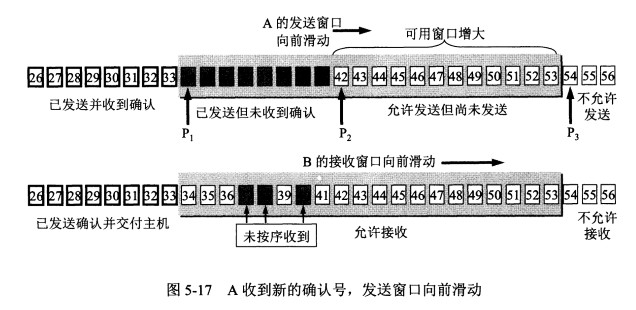

* [运输层](#%E8%BF%90%E8%BE%93%E5%B1%82)
  * [运输层协议概述](#%E8%BF%90%E8%BE%93%E5%B1%82%E5%8D%8F%E8%AE%AE%E6%A6%82%E8%BF%B0)
    * [进程间通信](#%E8%BF%9B%E7%A8%8B%E9%97%B4%E9%80%9A%E4%BF%A1)
    * [运输层两个主要协议](#%E8%BF%90%E8%BE%93%E5%B1%82%E4%B8%A4%E4%B8%AA%E4%B8%BB%E8%A6%81%E5%8D%8F%E8%AE%AE)
    * [运输层的端口](#%E8%BF%90%E8%BE%93%E5%B1%82%E7%9A%84%E7%AB%AF%E5%8F%A3)
  * [用户数据报协议(UDP)](#%E7%94%A8%E6%88%B7%E6%95%B0%E6%8D%AE%E6%8A%A5%E5%8D%8F%E8%AE%AEudp)
    * [UDP概述](#udp%E6%A6%82%E8%BF%B0)
    * [UDP首部](#udp%E9%A6%96%E9%83%A8)
  * [传输控制协议TCP](#%E4%BC%A0%E8%BE%93%E6%8E%A7%E5%88%B6%E5%8D%8F%E8%AE%AEtcp)
    * [TCP主要特点](#tcp%E4%B8%BB%E8%A6%81%E7%89%B9%E7%82%B9)
    * [TCP连接](#tcp%E8%BF%9E%E6%8E%A5)
  * [可靠传输的工作原理](#%E5%8F%AF%E9%9D%A0%E4%BC%A0%E8%BE%93%E7%9A%84%E5%B7%A5%E4%BD%9C%E5%8E%9F%E7%90%86)
    * [停止等待协议](#%E5%81%9C%E6%AD%A2%E7%AD%89%E5%BE%85%E5%8D%8F%E8%AE%AE)
    * [连续ARQ协议](#%E8%BF%9E%E7%BB%ADarq%E5%8D%8F%E8%AE%AE)
  * [TCP报文段的首部格式](#tcp%E6%8A%A5%E6%96%87%E6%AE%B5%E7%9A%84%E9%A6%96%E9%83%A8%E6%A0%BC%E5%BC%8F)
  * [TCP可靠传输的实现](#tcp%E5%8F%AF%E9%9D%A0%E4%BC%A0%E8%BE%93%E7%9A%84%E5%AE%9E%E7%8E%B0)
    * [以字节为单位的滑动窗口](#%E4%BB%A5%E5%AD%97%E8%8A%82%E4%B8%BA%E5%8D%95%E4%BD%8D%E7%9A%84%E6%BB%91%E5%8A%A8%E7%AA%97%E5%8F%A3)
    * [超时重传的时间选择](#%E8%B6%85%E6%97%B6%E9%87%8D%E4%BC%A0%E7%9A%84%E6%97%B6%E9%97%B4%E9%80%89%E6%8B%A9)
    * [选择确认SACK](#%E9%80%89%E6%8B%A9%E7%A1%AE%E8%AE%A4sack)
  * [TCP流量控制](#tcp%E6%B5%81%E9%87%8F%E6%8E%A7%E5%88%B6)
    * [利用滑动窗口实现流量控制](#%E5%88%A9%E7%94%A8%E6%BB%91%E5%8A%A8%E7%AA%97%E5%8F%A3%E5%AE%9E%E7%8E%B0%E6%B5%81%E9%87%8F%E6%8E%A7%E5%88%B6)
    * [TCP的传输效率](#tcp%E7%9A%84%E4%BC%A0%E8%BE%93%E6%95%88%E7%8E%87)
  * [TCP拥塞控制](#tcp%E6%8B%A5%E5%A1%9E%E6%8E%A7%E5%88%B6)
    * [拥塞控制的一般原理](#%E6%8B%A5%E5%A1%9E%E6%8E%A7%E5%88%B6%E7%9A%84%E4%B8%80%E8%88%AC%E5%8E%9F%E7%90%86)
    * [TCP拥塞控制方法](#tcp%E6%8B%A5%E5%A1%9E%E6%8E%A7%E5%88%B6%E6%96%B9%E6%B3%95)
      * [慢开始](#%E6%85%A2%E5%BC%80%E5%A7%8B)
      * [拥塞避免](#%E6%8B%A5%E5%A1%9E%E9%81%BF%E5%85%8D)
      * [快重传](#%E5%BF%AB%E9%87%8D%E4%BC%A0)
      * [快恢复](#%E5%BF%AB%E6%81%A2%E5%A4%8D)
      * [拥塞控制全过程分析](#%E6%8B%A5%E5%A1%9E%E6%8E%A7%E5%88%B6%E5%85%A8%E8%BF%87%E7%A8%8B%E5%88%86%E6%9E%90)
      * [AIMD算法](#aimd%E7%AE%97%E6%B3%95)
  * [TCP的运输连接管理](#tcp%E7%9A%84%E8%BF%90%E8%BE%93%E8%BF%9E%E6%8E%A5%E7%AE%A1%E7%90%86)
    * [TCP的连接建立](#tcp%E7%9A%84%E8%BF%9E%E6%8E%A5%E5%BB%BA%E7%AB%8B)
    * [TCP的连接释放](#tcp%E7%9A%84%E8%BF%9E%E6%8E%A5%E9%87%8A%E6%94%BE)

## 运输层

### 运输层协议概述

#### 进程间通信

- **网络层**为**主机**之间提供逻辑通信；**运输层**为**应用进程**之间提供逻辑通信。
- **`TCP`：全双工的可靠信道；`UDP`：不可靠信道**

#### 运输层两个主要协议

- 用户数据报协议`UDP`(`User Datagram Protocol`)
  - 在传输数据之前不需要先建立连接。远地主机的运输层在收到`UDP`报文后，不需要给出任何确认。
- 传输控制协议`TCP`(`Transmission Control Protocol`)
  - 提供面向连接的服务。在传输数据前必须先建立连接，数据传输后要释放连接。`TCP`不提供多播或广播服务。

#### 运输层的端口

- 复用：应用层所有的应用进程都可以通过运输层再传送到`IP`层。
- 分用：运输层从`IP`层收到发送给各个应用进程的数据后，必须分别交付指明的各个应用进程。
- `16`位的端口号用来 标志本计算机中的进程

### 用户数据报协议(UDP)

#### UDP概述

- 无连接
  - 发送前不需要建立连接
- 尽最大努力交付
  - 不保证可靠交付
- 面向报文
  - 对应用层交下来的报文既不拆分也不合并，加一个首部后就直接向下交付`IP`层
- `UDP`没有拥塞控制
  - 网络出现拥塞不会降低源主机发送速率
- `UDP`支持一对一、一对多、多对一、多对多的交互通信
- `UDP`首部只有`8`个字节

#### UDP首部

### 传输控制协议TCP

#### TCP主要特点

- 面向连接的运输层协议
  - 使用`TCP`协议之前要想先建立连接，传输数据完毕要释放已建立的连接。
- 每一条`TCP`只能有两个端点，即`TCP`连接只能是点对点的。
- `TCP`提供可靠交付的服务。
  - 经过`TCP`连接传送的数据无差错、不丢失、不重复、按序到达。
- `TCP`提供全双工通信
  - `TCP`连接的两端都设有发送缓存和接收缓存，用来临时存放双向通信的数据。

- 面向字节流
  - 应用进程和`TCP`的交互是一次一个大小不等数据块，但`TCP`把应用程序交下来的数据仅仅看成一连串无结构的字节流。并不知道字节流的含义。

#### TCP连接

-  `TCP`连接的端点叫套接字(`socket`)或插口
- `scoket` =  `IP`地址 : 端口号
- 每一条`TCP`连接惟一的被通信两端的两个端点所确定，同一个端口号可以出现在多个不同的`TCP`连接中。

### 可靠传输的工作原理                                                  

#### 停止等待协议

1. 无差错情况

   

2. 出现差错

   

   1. B收到M1时检测到出了错，就丢弃并什么也不做。
   2. A超时重传
   3. 注意：
      1. A发送完一个分组后，必须暂时保留已发送的分组的副本。收到相应确认后才能清楚。
      2. 传输的数据单元必须进行编号。
      3. 超时重传时间要大于平均往返时间

3. 确认丢失和确认迟到

   

   1. B发送的对M1的确认丢失了，导致A超时重传
   2. B再次收到M1，丢弃这个重复的M1，再次向A发送确认。

   

   1. B对M1的确认迟到了，
   2. A会收到重复确认，丢弃重复确认
   3. B会收到重复M1，丢弃重复M1

   - **利用上述机制可以在不可靠的传输网络上实现可靠地通信。这种可靠传输协议称为自动重传请求`ARQ`。**

4. 信道利用率

   - 上述停止等待协议实现简单，但信道利用率太低，往返时间远大于分组发送时间。为了提供信道利用率，采用流水线传输。

     

   - 流水线传输可连续发送多个分组，不必发完一个分组就停下来等待确认。因此就涉及到连续`AQR`协议和滑动窗口协议。

#### 连续ARQ协议

- 位于发送窗口内的5个分组都可以连续发送出去，不需要等待对方的确认。

  

- 接收方采用累积确认，即对按序到达的最后一个分组发送确认。(比如上图发送12345，3丢失，1245正常接收，就只确认12，下次发34567)

### TCP报文段的首部格式

- MSS仅指数据字段长度，不包括首部
- 6个控制位
  1. `URG(urgent)`：当`URG=1`时紧急指针有效。表明应用进程告诉发送方`TCP`有紧急数据要传送，于是发送方`TCP`就将紧急数据插到本报文段数据的最前面，与紧急指针配合使用。
  2. `ACK(ackonwledgment)`：当`ACK=1`时确认号才有效。连接建立后所有传送的报文段的`ACK`必须为1.
  3. `PSH(push)`：接收方收到`PSH`为1的报文段时，就尽快交付接收应用进程，而不在等到整个缓存都填满了再向上交付。
  4. `RST(reset)`：`RST=1`表示`TCP`连接出现严重差错，必须释放连接再重新建立连接。
  5. `SYN(synchronization)`：`SYN=1`表示这是一个**连接请求**或**连接接受**报文。`SYN=1`且`ACK=0`表明是连接请求，`SYN=1`且`ACK=1`表明是连接接受。
  6. `FIN(finis)`：`FIN=1`表明此发送方的数据已发送完毕并要求释放连接。

### TCP可靠传输的实现

#### 以字节为单位的滑动窗口

- 
- 图5-15，A的发送窗口一定不能超过B的接收窗口值。发送窗口后沿后面数据不需要再保留；发送窗口前沿前面数据不允许发送。发送窗口后沿位置可能不动可能前移；发送窗口前沿位置通常不断前移，也可能不动或者后移。因为对方的通知窗口是动态变化的。
- 
- 图5-16，P3-P1：A的发送窗口，P2-P1：已发送尚未收到确认，P3-P2：允许发送但尚未发送
- 图5-16，如果B收到了32、33字节，但由于没有收到31，所以它俩不是按序到达，因此B的确认号为31
- 
- 图5-17，B收到31~33，向A发送的确认号变为34，窗口值仍为20，所以A的发送窗口相对图5-16前移3个序号
- 
- 图5-18，A需要等待超时重传。时间由超时计时器控制。
- 发送方应用进程把字节流写入TCP的发送缓存，接收方的应用进程从TCP的接收缓存中读取字节流。
- A的发送窗口是根据B的接收窗口来设置的，但在同一时刻，A的发送窗口并不总是等于B的接收窗口。A可能根据拥塞情况减小自己的发送窗口
- 对不按序到达的数据(如图5-16的32、33字节数据)如何处理，TCP并无明确规定。
- TCP要求接收方必须有累积确认功能以减小传输开销。

#### 超时重传的时间选择

- **RTT**：报文段的往返时间。即发送报文并收到确认的时间。
- **RTTs**：报文段的加权平均往返时间。
  - 第一次：`RTTs=RTT`
  - 以后：`RTTs=7/8旧RTTs + 1/8新RTT`
- **RTTd**：RTT的偏差的加权平均值。
  - 第一次：`1/2RTT`
  - 以后：`3/4旧RTTd + 1/4|RTTs - 新的RTT|`
- **RTO**：超时重传时间。
  - `RTO=RTTs + 4RTTd`

#### 选择确认SACK

- 大多数实现还是重传所有未被确认的数据块。
- 选择确认指：若收到的报文无差错，只是未按序到达。比如接收方收到了1-1000，2001-3000，而1001-2000没有收到，即接收方收到了不连续的字节块。如果这些字节序号都在接收窗口内，那么接收方就先收下数据，然后把这些信息准确告诉发送方，使发送方不要重复发送已收到的数据。

### TCP流量控制

#### 利用滑动窗口实现流量控制

- 流量控制：让发送方的发送速率不要太快，要让接收方来得及接收。
- `rwnd`(receiver window)：接收窗口
- 
- 图5-22，发送方的发送窗口不能超过接收方给出的接收窗口的数值。即**通过`rwnd`来调节发送方的发送窗口。**
- 特例：B向A发送了零窗口的报文段后不久，B的接收缓存有了一些空间，于是向A发送`rwnd`=400，但这个报文段传送过程中丢失了，导致产生死锁。
- 解决方案：每个TCP连接设有一个持续计时器。只要TCP连接的一方收到零窗口通知，只启动持续计时器。若持续计时器设置的时间到期，就发一个1字节的零窗口探测报文，对方就在确认这个探测报文段时给出现在的窗口值。

#### TCP的传输效率

- 应用进程把数据传送到TCP的发送缓存后，剩下的任务由TCP来控制，通过不同的机制控制TCP发送报文的时机。
  1. 机制一：TCP维持一个变量MSS(最大报文段长度)，只要缓存中存放的数据达到MSS字节就发送。
  2. 机制二：由发送方的进程指明要求发送报文段，即TCP支持的推送操作。
  3. 机制三：发送方的一个计时器期限到了，就把当前已有的缓存数据装入报文段发送出去(不能超过MSS)
- 特例1：如果用户每次只发送一个字节，那么整个传输过程中IP数据报首部和TCP首部的长度远大于传输的数据，导致效率低下
- 解决方案：`Nagle`算法：发送方把第1个数据字节先发送出去，后面到达的字节都缓存起来，当收到前一个报文段的确认后才继续发送下一个报文段，当到达的数据已达到发送窗口大小的一半或MSS时，就立即发送一个报文段。
- 特例2(糊涂窗口综合征)：接收方缓存已满，接收方应用进程每次只从接收缓存中读取1个字节，然后向发送方发送确认，并把窗口设置为1字节，于是发送方发来1字节的数据，但IP数据报长度为41字节，效率依然低下
- 解决方案：让接收方等待一段时间。当接收缓存有一半空闲空间或者能容纳一个MSS长度报文时通知发送方当前的窗口大小。
- 以上方法配合使用，使得**在发送方不发送很小的报文段的同时，接收方也不要在缓存刚刚有了一小点的空间就急忙把这个很小的窗口大小通知给发送方。**

##### 粘包

- `Nagle`算法：**将多次间隔较小、数据量较小的数据，合并成一个数据量大的数据块，然后进行封包。**
- 粘包：发送方发送的若干包数据到达接收方时粘成了一包，从接收缓冲区来看，后一包数据的头紧接着前一包数据的尾。
- 原因：
  - 发送方：TCP默认使用Nagle算法，Nagle算法主要是减少网络中报文段的数量，而Nagle主要做两件事
    - 只有上一个分组得到确认，才会发送下一个分组
    - 收集多个小分组，在一个确认到来时一起发送
  - 接收方：接收到的数据包保存在接收缓存里，然后应用程序主动从缓存读取收到的分组。如果接收数据包的速度大于应用程序从缓存中读取数据包的速度，多个包就会被缓存，应用程序就有可能读取到多个首尾相连的包。
- 什么时候需要处理粘包
  - 如果多个分组毫不相干，甚至是并列关系就需要处理，如果是同一数据的不同部分就不需要处理
- 如何处理粘包
  - 发送方：关闭Nagle算法
  - 接收方：无法处理
  - 应用程序：从接收缓存中读取分组时，读完一条数据，就应该循环读取下一条数据，直到所有数据都被处理完成，获取数据长度方式：
    1. 发送长度：发送每条数据时，将数据的长度一并发送，例如规定数据的前4位是数据的长度，应用层在处理时可以根据长度来判断每个分组的开始和结束位置。
    2. 格式化数据：每条数据有固定的格式（开始符，结束符），但是一定要确保每条数据的内部不包含开始符和结束符。

- TCP是基于流的传输，UDP是面向消息传输的，接收方一次只能接受一条独立的消息，所以**没有粘包问题**

### TCP拥塞控制

#### 拥塞控制的一般原理

- 拥塞：对资源的需求 > 可用资源
- 拥塞控制：防止过多的数据注入网络中，可以使网络中的路由器或链路不致过载。是一个全局性的过程，涉及所有的主机、路由器及其他所有的因素。
- 流量控制：往往指点对点通信量的控制，是个端到端的问题。
- 
- 图5-23，横坐标可理解为单位时间输入给网络的分组数，纵坐标可理解为单位时间网络输出的分组数
- 从大的方向看，拥塞控制分为开环控制和闭环控制
  - 开环控制：事先将有关发生拥塞的因素考虑周到，系统运行后就不再更改
  - 闭环控制：基于反馈环路，检测拥塞发生的时间、地点，把拥塞信息发送到可采取行动的地方，调整网络的运行以解决问题。

#### TCP拥塞控制方法

- 算法：慢开始、拥塞避免、快重传、快恢复

- 发送方维持一个拥塞窗口(cwnd,`congestion window`)的动态变量，其大小取决于网络拥塞程度。发送方让自己的发送窗口等于拥塞窗口。
- 判断网络拥塞的依据就是出现了超时。

##### 慢开始

- **由小到大逐渐增大拥塞窗口数值。**
- `SMSS(Sender Maximum Segment Size)`：发送方最大报文段。初始`cwnd`为`2~4个SMSS`的值。
- `cwnd`每次增加量：`min(N,SMSS)`。N是原先未被确认的、但现在被刚收到的确认报文段所确认的字数。
- 
- 图5-24，每经过一个传输轮次，拥塞窗口`cwnd`就加倍。
- 慢开始的慢指：在TCP开始发送报文时cwnd较小，然后再逐渐增大cwnd，这样设置比一下子把许多报文段注入网络中要慢得多。
- 防止`cwnd`增长过大造成网络拥塞，还需设置一个慢开始门限(`sshresh`)
  - `cwnd < ssthresh`时，用上述**慢开始算法**
  - `cwnd = ssthresh`时，既可用**慢开始算法**也可用**拥塞避免算法**
  - `cwnd > ssthresh`时，用**拥塞避免算法**

##### 拥塞避免

- 拥塞避免：**让拥塞窗口`cwnd`缓慢增大，每经过一个`RTT`就加1，不像慢开始那样加倍增长。**

##### 快重传

- **让发送方尽早知道发生了个别报文段的丢失。发送方一连收到3个重复的ACK即可断定有分组丢失，就会重传丢失的报文段而不是继续等待超时重传。**

- 
- 图5-26，接收方收到了M1和M2后及时发出了确认。接收方没有收到M3，但收到了M4，本来接收方可以什么都不做，但按照快重传算法，**为了让发送方尽早知道发生M3的丢失，**接收方必须立即发送对M2的重复确认，接收方后续收到M5，M6后，也要再次发出对M2的确认，发送方一共收到3个重复确认。快重传算法规定，发送方只要一连收到3个重复确认，就知道接收方没有收到M3，应当立即进行重传(即快重传)。

##### 快恢复

- **重新设置慢开始门限(`ssthresh`)，同时设置`cwnd = ssthresh`，并启用拥塞避免算法。**

##### 拥塞控制全过程分析

- 

1. `ssthresh`初始16，`cwnd`初始为1，启用慢开始算法。发送方每收到一个新报文段的确`ACK`，就把拥塞窗口加1。
2. `cwnd`增长到16，达到慢开始门限时，启用拥塞避免算法。拥塞窗口按规律线性增长。
3. `cwnd`增长到24时，出现超时，发送方判断为网络拥塞，调整`ssthresh`为`cwnd`一半，即12，将`cwnd`置1，启用慢开始算法
4. `cwnd`增长到12，达到`ssthresh`，启用拥塞避免算法
5. `cwnd`增长到16时，出现新的情况，发送方一连收到3个`ACK`，根据快重传算法它知道是丢失了个别报文段，于是执行快恢复算法，将`cwnd`、`ssthresh`调整为原`cwnd`一半，再次启用拥塞避免算法。

##### AIMD算法

- 加法增大(`Additive Increase`)：拥塞避免阶段，`cwmd`线性规律增大。
- 乘法减小(`Multiplicative Decrease`)：出现超时或收到3个重复`ACK`时，`ssthresh`调整为当前`cwnd`的一半，并大大减小`cwnd`。

### TCP的运输连接管理

- TCP建立连接要解决的问题
  1. 使每一方确认对方的存在
  2. 允许双方协调一些参数
  3. 能够对运输实体资源进行分配

#### TCP的连接建立

- 

1. 初始都处于`closed`状态，A主动打开连接。

2. B创建传输控制块`TCB`(存储`TCP`连接表等信息)，接受客户连接请求，处于`LISTEN`状态

3. A也创建`TCB`，再向B发送请求本文段，首部中`SYN=1`，同时选一个初始序号`seq=x`。(TCP规定SYN=1的报文段不能携带数据，但要消耗一个序号)此时A进入`SYN-SEND`状态。

4. B收到连接请求后，如果同意建立连接也要向A发送确认。确认报文中`SYN=1`、`ACK=1`,确认号`ack=x + 1`，同时自己也选一个`seq = y`，同样不能携带数据但要消耗一个序号。此时B进入`SYN-REVD`状态。

5. A收到B的确认后，还要向B发确认。确认报文段中`ACK`置1，确认号`ack=y + 1`。自己的序号`seq=x + 1`。此时A进入`ESTABLISHED`状态。

6. B收到A的确认后，也进入`ESTABLISHED`状态。

- A最后还要发一次确认的原因：
  - 特殊情况：A发送第1个连接请求在某处滞留时间过长，A发送第2个连接请求，接着连接建立成功，传输数据，释放连接。这时第1个连接请求到达B，B以为A又发出一次连接请求，就同意连接。如果不需要A最后确认，那么连接就建立成功了，就等待A发数据，但A不会理睬B，导致B的资源浪费了。

#### TCP的连接释放

- 

1. 开始A和B都处于`ESTABLISHED`状态。

2. A发出连接释放报文段。首部中`FIN=1`,序号`seq=u`。A进入`FIN-WAIT-1`状态。TCP规定FIN报文段即使不携带数据也消耗一个序号。

3. B收到释放报文段后发出确认，确认号是`ack=u + 1`，序号是`seq=v`，B进入`CLOSE-WAIT`状态。此时TCP连接处于半关闭状态。即`A->`B关闭，`B->A`尚未关闭。

4. A收到来自B的确认后，进入`FIN-WAIT-2`状态，等待B的释放连接报文段。

5. 若B没有要向A发送的数据，那么B发出的连接释放报文段就必须使`FIN=1`。假定B的序号为w，B还必须重复上次的确认号`ack=u + 1`。此时B进入`LAST-ACK`状态。

6. A收到B的连接释放报文段后，发出确认报文段，其中ACK置1，确认号`ack = w + 1`，序号`seq= u + 1`。然后A进入`TIME-WAIT`状态。

7. 此时连接还没有释放掉，必须经过时间等待计时器设置的时间`2MSL`后A才进入`CLOSED`状态。A撤销了相应的`TCB`后，才结束这次连接。
8. B收到A发出的确认报文段，进入CLOSED状态。B撤销TCB模块后结束此次TCP连接。

- A需要等待`2MSL`原因：
  - **保证A发送的最后一个ACK报文段能到达B**。如果B收不到A发送的最后一个ACK，B会超时重传，如果A已经`CLOSED`掉，就无法重传，B就无法进入`CLOSED`状态。
  - **保证本连接持续的时间内所产生的所有报文都从网络中消失。**

- 大量close_wait
  - 危害：一个端口上打开的文件描述符超过一定数量(1024)，那么新来的socket就无法建立连接了，报错too many open files
  - 原因：对方关闭socket连接时，我方忙于读或写，没有及时关闭连接
    - 检查代码，特别是释放资源的代码
    - 检查配置，特别是处理请求的线程配置

- 滑动窗口
  - 即接收端的接收窗口大小，用来告知发送方接收方的接收缓存大小，以此控制发送方发送数据的的大小，从而达到流量控制的目的

- 三次握手最后一次ACK包丢失会怎样
  - 客户端：此时成功建立连接。它向服务端发送数据，服务端一RST包作响应，方能感知到服务端的错误。
  - 服务端：超时重传上一次的ACK报文，默认5次重发，重发间隔为3、6、12s，如果仍为收到，就关闭连接

